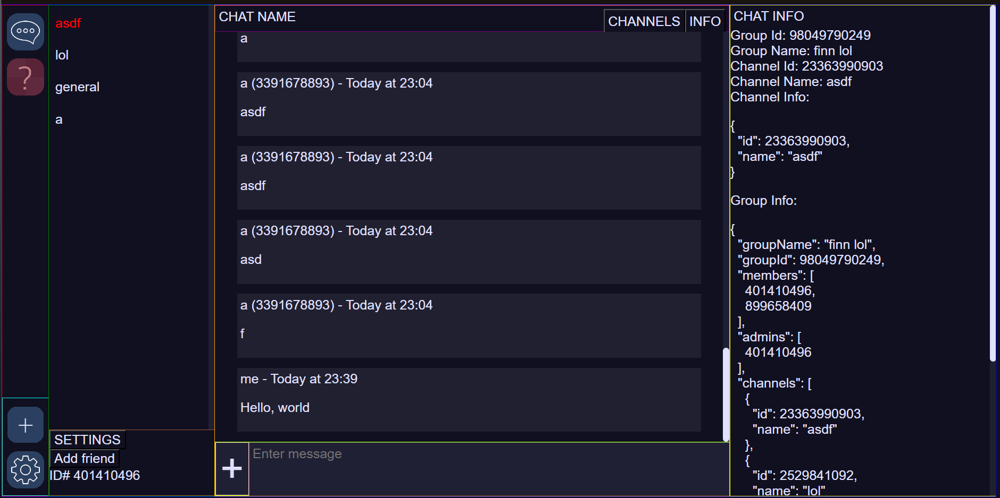

# Goofy Chat App v2

This is the 2nd version of [goofy chat app](https://github.com/marceldobehere/goofy-chat-app).

It is essentially a secure end-to-end encrypted chat app that allows users to chat with each other in real-time.

NOTE: It is still WIP right now, but its mostly in a usable state!




It is statically hosted [here](https://marceldobehere.github.io/goofy-chat-app-v2-client/client/)!

Also NOTE: This is only the statically hosted client. The server can be found [here](https://github.com/marceldobehere/goofy-chat-app-v2). 

## Features

### Implemented Features
* End-to-end encryption
* Private Chats
* Cross Device Sync
* Fully Open Source
* Markdown Support (With Syntax Highlighting)

### Mostly working Features
* Group Chats
* Image/Video/File Sharing
* Embedded Images/Videos/Audios

### Partially implemented Features
* Private/Group Voice/Video calls (using WebRTC)

### Planned Features
* Friend System / DMs (?)
 * People sending friend/message requests before being able to chat with you
 * Blocking people
 * Having open/closed "DMs"
* Notifications
* Upload Status Bar
* Improved mobile usability
* Potentially PWA Features (?)
* Preferred Server for decentralized communication
* Dynamic Chat List for improved performance
* Pings
* Message Reactions
* Optional Message Read Acknowledgements
* Stickers (?)
* Portable Core Client Lib in NodeJS/Java (May be in progress)
* Improved Voice Chats / Potential integration into the main app
* Multiple fully seperated Accounts
* Customizable UI/Themes


## Goofy Chat 2 vs Goofy Chat 1

The main difference between Goofy Chat 2 is the improved way of handling secure communication, group chats and P2P Voice/Video calls.

There are also minor things like the support for communication using decentralized servers and more.

This is also an attempt to turn this into a slowly more usable project.


## The idea

### Background

E2E encryption is secure but the main problem lies within the key exchange.

For fun I tried to make a secure chat app and stumbled upon this issue.

From what I understand most applications offering E2E store userids and their corresponding public key.
This means that you have to trust the server to give you the right keys. 

This is a problem in two ways: The given public key could be wrong / manipulated and userids are specific to one server (if not planned).

If a user wants to talk to another user they will need to request the public key and then afterwards verify it in a secure channel to be safe.

### Solution

The main idea I have come up with is to bind the cryptographic identity to a user id. 
This can be achieved by making the userid be the hash of the public key.

Now if a user knows the userid of another user, they can request the public key and then verify the integrity of the public key by hashing and comparing it to the userid.

This way the user can be sure that the public key is correct and the user can be sure that the public key is bound to the userid.

This removes the need for an extra verification step via a secure channel.
Users just need to know the userid of other users.


Additionally users can use their public keys across different servers and still be able to communicate with the same userid.
(The servers would need to use the same hashing algorithm)

### Drawbacks

The main issue is the generation of the userid.

The userid should not be extremely long and should be simple to be communicated.

This means that there exists a possibility of collisions and potential brute force attacks.

The brute force attack can be mitigated by using a slow, secure hashing algorithm.

As for the collisions, there is yet to find a balance between usability and security.
(Personally I think that a realistically usable and secure solution can be found)

### TL;DR

By binding the cryptographic identity to a user id, users can communicate securely without the need for a secure channel to verify the public key.

This allows users to use decentralized servers while keeping their user ids and secure communication.

The chats are E2E encrypted meaning that the only thing the server could do is drop or replay messages.


### Implementation details

Please note that this is a WIP project and the implementation is far from ideal and can change.

#### Encryption

For the general encryption I am using AES and RSA.

For a conversation between two users there are two symmetric keys for both directions.
This removes the need to decide on a single key from both sides.

The userids are currently hashed using a pbkdf2, where the first word is extracted from the result.
The result is an integer. This current way will most likely change in the future, but is good/secure enough for now. 
It is still unknown whether the userid will remain numeric or if it will be alphanumeric.

Currently the server uses a secure websocket connection to communicate with the clients.

### Message Structure for server communication

Users can send the messages to a server. Currently they are plain text JSON objects.

The structure is as follows
```
{
    from: number, (user id)
    to: number, (user id)
    data: any,
    store: boolean
}
```

Note that the store field is optional.
It is used to determine what the server should do in case the recipient is not connected.
If store is true the server will store the message and send it to the recipient once they are connected.
If store is false the server will drop the message.

The data field will be the actual data.
The server is set up so that the client can send any data they want.
This means that both clients need to know how to handle the data.
But it also allows separate clients to have their own data structures.

Also note that on reception the object will contain one additional field.
This field is the date field and contains the UTC timestamp of when the message was received by the server.

#### Server communication and key exchange

Each user has a public and private key pair. 
They then share their public key with the server and verify their identity through a challenge-response mechanism.

Users can request the public key of another user by sending a request to the server. 
The server will then respond with the public key of the user if it has one.
The user will then hash the public key and compare it to the userid to verify the integrity of the public key.

#### Conversation initiation

When initiating a conversation user A will generate a symmetric key and encrypt it with the public key of user B. 
User A will also send them a signature of the key.

User B will then decrypt the symmetric key and verify the signature. 
If the signature is correct user B will generate a symmetric key and send it back to user A encrypted with the public key of user A.

Currently the symmetrically encrypted messages are not signed. 
It is currently assumed that exchanged symmetric keys have been securely exchanged and therefore a signature is not needed.
This could potentially change in the future.

#### Conversation

Messages will be encrypted with the symmetric key of the conversation and then sent to the server.

The server acts as only a relay and will pass the message to the recipient once the recipient is connected.

The recipient will then decrypt the message and handle it accordingly.

Each message also has a random unique id to prevent firstly prevent replay attacks and secondly for synchronization purposes.

##### Message Types
Messages can have different types for different functions.

There are normal text messages, but also messages to set the symmetric key, redirect messages, group chats, voice channels, etc.

These will be handled accordingly.


### Implementation details of features

#### Cross Device Sync

(Implementation details yet to follow)


#### Group Chats

(Implementation details yet to follow)


#### Voice/Video Calls

Essentially the server acts as a signaling server for the two users to establish a P2P WebRTC connection.

The clients will exchange their ICE candidates and SDP offers/answers through the server using special message types.

Currently the STUN servers are hardcoded and set to the Google STUN servers.

(Implementation details yet to follow)

#### File/Image sending

(Implementation details yet to follow)


## External Libraries
* [CryptoJS](https://github.com/brix/crypto-js/tree/develop)
* [JSEncrypt](https://github.com/travist/jsencrypt)
* [Socket.io](https://github.com/socketio/socket.io)
* [Dexie.js](https://github.com/dexie/Dexie.js)
* [Dexie Easy Encrypt](https://github.com/jaetask/dexie-easy-encrypt/)
* [Marked](https://github.com/markedjs/marked)
* [DOMPurify](https://github.com/cure53/DOMPurify)
* [Highlight.js](github.com/highlightjs/highlight.js)
